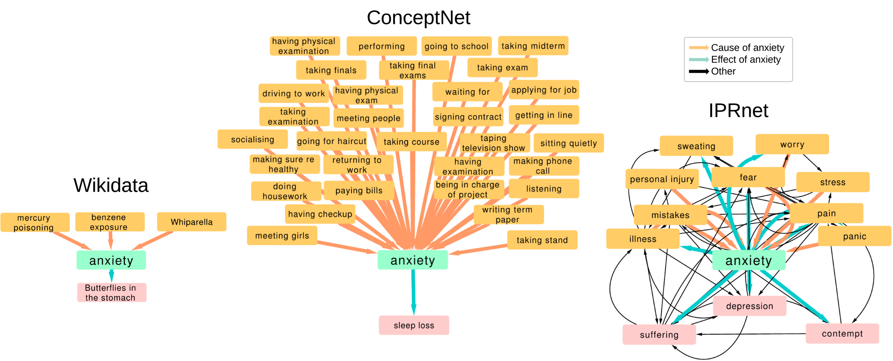

# NetFUSES




_Network FUsion with SEmantic Similarity_ (NetFUSES) is a __graph fusion__ algorithm for coalescing networks of distinct sets of nodes into 
a single network when node identity is unreliable or ambiguous. 
Graph fusion is a unique problem associated with combining nodes both across and inside of networks.
NetFUSES combines nodes using a given similarity function, allowing researchers in different domains to use NetFUSES by introducing their own similarity measures.


### Table of Contents
- [Example](#usage)
- [Installation](#install)
- [Algorithm Overview](#algoverview)
- [Citation Information](#citation)


## Example <a name="example"/>

Suppose we have three separate graphs: `G1`, `G2`, and `G3`. Associated with each node in these graphs is a written text entity or "sentence".   We can capture the semantics of these natural language text by mapping each entity into a 
high-dimensional vector space, making a "sentence vector".

Here we can identify and fuse semantically-equivalent nodes across the three graphs using a cosine similarity function based on these sentence vectors:

```python
import netfuses as nf
import scipy.spatial

def cosine_similarity(u, v):
    return 1 - scipy.spatial.distance.cosine(sentence_vectors[u], sentence_vectors[v])

G1, G2, G3 = IMPORT_KNOWLEDGE_GRAPHS(...)
sentence_vectors = IMPORT_SENTENCE_VECS(...)  # maps text entities to sentence embeddings

sentence_fuser = nf.NetworkFuser(cosine_similarity, threshold=0.95)

fused_sentences = sentence_fuser.fuse(G1, G2, G3)
G, node2fuseid = sentence_fuser.collapse(fused_sentences)
```

NetFUSES lets us combine nodes based on the semantic information contained within these sentence vectors. 
Using these knowledge graphs and precomputed vectors, we can invoke NetFUSES to obtain a fused graph `G`, removing redundancies and giving a unified representation of the knowledge embedded within the separate entities.


## To Install <a name="install"/>
To install, first download the NetFUSES repository. 

Change directories into the newly cloned repository with:
```bash
cd NetFUSES
```

Run:
```bash
pip install --upgrade netfuses
```

This will install both `netfuses` and its required dependency, `networkx==1.11`.

If pip is not installed on your machine or you would not like to use it, you can
run the following command from inside of the NetFUSES directory:

```bash
python setup.py install
```


## Algorithm Overview <a name="algoverview"/>

The NetFUSES algorithm consists of two stages - fusing and collapsing;
- Fusing draws analogs between nodes across the set of graphs to fuse
- Collapsing takes nodewise analog components and merges them into a single node
    by taking each member of the component and drawing edges between it and its neighbors.
    If the neighbor is already contained in the component, a self loop is drawn.

This version is implemented to support different similarity functions, manifested
by a parameter to `NetworkFuser`, `simfn`. As described in the docstring, `simfn`
takes as input two network nodes _u_ and _v_, any other keyword arguments necessary. 

### Algorithm Usage
NetFUSES is able to fuse a variety of networks. See below for an example.

Consider two directed networks of textual entities in which edges _(i, j)_ exist if and
only if there is evidence to show that _i_ __causes__ _j_. This network however is
imperfect in that two nodes _i_ and _i'_ may be semantically identical based on some
similarity. We'd like to get a more in depth, denser network structure to further understand
causal relationships. Hence, we will apply NetFUSES to combine the two networks.

Here we can define different notions of similarity across text. In one case,
we could map each textual entity to
<a href="https://en.wikipedia.org/wiki/Sentence_embedding">sentence embeddings</a> 
and define similarity by <a href="https://en.wikipedia.org/wiki/Cosine_similarity">cosine similarity</a>
between vector.

```python
sentence_vectors = IMPORT_SENTENCE_VECS(...)  # maps causal entities to sentence embeddings
import scipy.spatial

def cosine_similarity(u, v):
    return 1 - scipy.spatial.distance.cosine(sentence_vectors[u], sentence_vectors[v])
```

In another case, if we recognize that semantically identical nodes often times overlap in vocabulary
and word placement (i.e, <q>sweating</q> and <q>sweating bullets</q>), we may utilize a version
of the <a href="https://en.wikipedia.org/wiki/Levenshtein_distance">Levenshtein distance</a>
a method for determining how many moves it takes to change one string to another.

```python
from jellyfish import levenshtein_distance     # library for levenshtein distance

def levenshtein_similarity(u, v):
    return 1 - (1/levenshtein_distance(u, v)
```

Here we will apply NetFUSES to three causal attribution subgraphs centered around the word <q>anxiety</q>
as shown above.

For the sake of the example we will assume these graphs are stored predefined as variables
`wikidata`, `conceptnet`, and `iprnet`.

```python
import netfuses as nf

wikidata, conceptnet, iprnet = IMPORT_GRAPHS(...)

levenshtein_fuser = nf.NetworkFuser(levenshtein_similarity, threshold=0.95) 
sentence_embedding_fuser = nf.NetworkFuser(cosine_similarity, threshold=0.95)

fused_lev = levenshtein_fuser.fuse(wikidata, conceptnet, iprnet)
collapsed_lev, node2fuseid_lev = levenshtein_fuser.collapse(fused_lev)

fused_sent = sentence_embedding_fuser.fuse(wikidata, conceptnet, iprnet)
collapsed_sent, node2fuseid_sent = sentence_embedding_fuser.collapse(fused_sent)


final_fused_lev = nf.convert_graph(collapsed_lev)
final_fused_sent = nf.convert_graph(collapsed_sent)
```


## Citation Information <a name="citation"/>

Please cite NetFUSES if you use it in your work:

Inferring the size of the causal universe: features and fusion of causal attribution networks,<br/>
D. Berenberg, and J.P Bagrow, [arXiv:1812.06038](http://arxiv.org/abs/1812.06038) (2018)

```bibtex
@article{berenberg2018,
  author    = {Daniel Berenberg and James P. Bagrow},
  title     = {Inferring the size of the causal universe: features and fusion of causal attribution networks},
  journal   = {CoRR},
  volume    = {abs/1812.06038},
  year      = {2018},
  url       = {http://arxiv.org/abs/1812.06038},
  archivePrefix = {arXiv},
  eprint    = {1812.06038},
}
```


